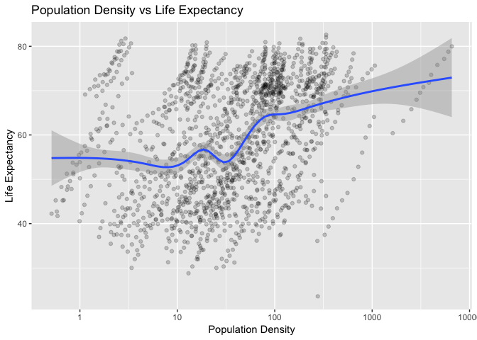
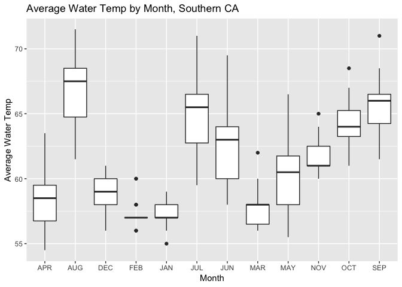
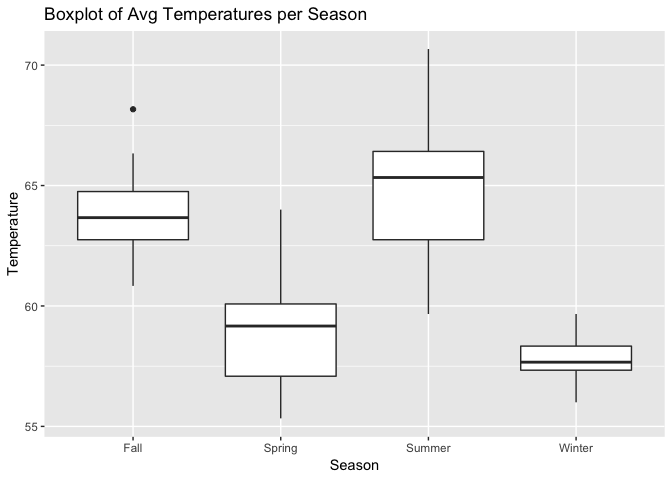
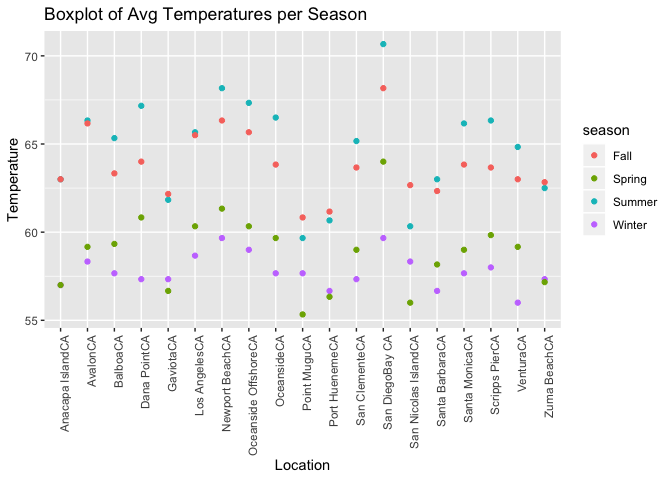
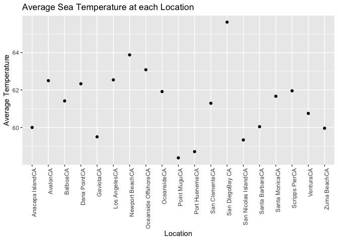
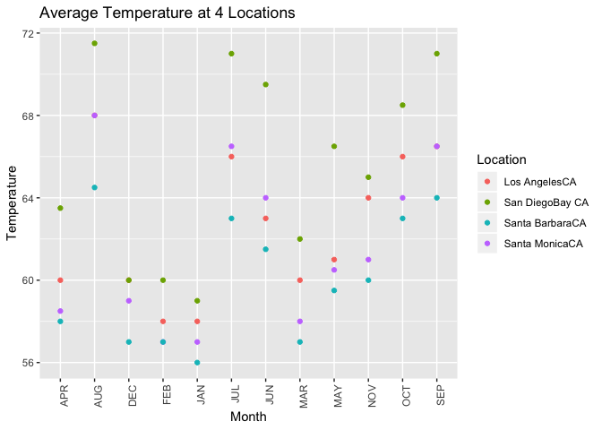

hw8
================
Abby Bergman
11/22/2018

Part 1: Exploring Population Density
====================================



As shown above, Life Expectancy appears to increase with Population Density, when plotted on the log scale. The correlation between the two variables does not appear to be very strong.

``` r
#regression model
density_model <- lm(lifeExp ~ popden, 
                   data = combined1)
summary(density_model)
```

    ## 
    ## Call:
    ## lm(formula = lifeExp ~ popden, data = combined1)
    ## 
    ## Residuals:
    ##    Min     1Q Median     3Q    Max 
    ## -36.75 -11.13   0.81  11.46  23.10 
    ## 
    ## Coefficients:
    ##              Estimate Std. Error t value Pr(>|t|)    
    ## (Intercept) 5.863e+01  3.443e-01 170.300  < 2e-16 ***
    ## popden      6.197e-03  8.713e-04   7.113 1.74e-12 ***
    ## ---
    ## Signif. codes:  0 '***' 0.001 '**' 0.01 '*' 0.05 '.' 0.1 ' ' 1
    ## 
    ## Residual standard error: 12.87 on 1522 degrees of freedom
    ##   (180 observations deleted due to missingness)
    ## Multiple R-squared:  0.03217,    Adjusted R-squared:  0.03154 
    ## F-statistic: 50.59 on 1 and 1522 DF,  p-value: 1.744e-12

The above regression model shows that there is a relationship between Life Expectancy and Population Density, with a high level of significance (p &lt; .05).

Part 2: Exploring Water Temperature on the Pacific Coast
========================================================

For this part of the assignment, I was interested in exploring the average water temperatures occurring along the Southern California coast, throughout the year. The data was retrieved from [here](https://www.nodc.noaa.gov/dsdt/cwtg/all_meanT.html) and includes average temperatures for each beach location for every month. The average temps are calculated over time.



The highest average water temperatues occurred in August, followed by September, July and June. The lowest temperatures occurred in January and February. The highest average temperature is in the high 60s (Aug) and the lowest is in the high 50s (Feb).



The above boxplots shows the average temperatures across all the beach locations for each season. As expected, Summer had the highest average temperatures, although with a large range of temperatures. Winter had the lowest average temperatures.



The above graph shows the four seasonal averages for each location along the OSuthern California coast. For most locations, the highest temperature occurred in the Summer seaosn. However, some locations (ex: Oceanside and Point Mugu) saw higher tesperatures in the Fall.



This graph plots the average yearly temperature for each location. San Diego saw the highest average sea temperature, while Point Mugu had the lowest average sea temperature.

``` r
water_clean %>%
  filter(Location == "San DiegoBay CA" | Location == "Santa MonicaCA" | Location == "Santa BarbaraCA" | Location == "Los AngelesCA") %>%
  gather(`JAN`, `FEB`, `MAR`, `APR`, `MAY`, `JUN`, `JUL`, `AUG`, `SEP`, `OCT`, `NOV`, `DEC` ,key = month, value = temp) %>%
group_by(month) %>%
  ggplot(aes(month, temp, color = Location)) +
  geom_point() +
  theme(axis.text.x = element_text(angle = 90, hjust = 1)) +
  labs(title = "Average Temperature at 4 Locations", x = "Month", y = "Temperature")
```



This graph shows the monthly average temperatures for four popular and well-known beach locations along the Southern California coast. The highest temperatures seem to have occurred in July, August, and September across the four beaches, although there is a large amount of variability.

``` r
temp_model <- lm(temp ~ season, 
                   data = water_season)
summary(temp_model)
```

    ## 
    ## Call:
    ## lm(formula = temp ~ season, data = water_season)
    ## 
    ## Residuals:
    ##     Min      1Q  Median      3Q     Max 
    ## -5.1053 -1.1250  0.0351  1.4101  5.8947 
    ## 
    ## Coefficients:
    ##              Estimate Std. Error t value Pr(>|t|)    
    ## (Intercept)   63.7982     0.4781 133.430  < 2e-16 ***
    ## seasonSpring  -4.9211     0.6762  -7.278 3.39e-10 ***
    ## seasonSummer   0.9737     0.6762   1.440    0.154    
    ## seasonWinter  -6.0088     0.6762  -8.886 3.40e-13 ***
    ## ---
    ## Signif. codes:  0 '***' 0.001 '**' 0.01 '*' 0.05 '.' 0.1 ' ' 1
    ## 
    ## Residual standard error: 2.084 on 72 degrees of freedom
    ## Multiple R-squared:  0.6891, Adjusted R-squared:  0.6762 
    ## F-statistic:  53.2 on 3 and 72 DF,  p-value: < 2.2e-16
